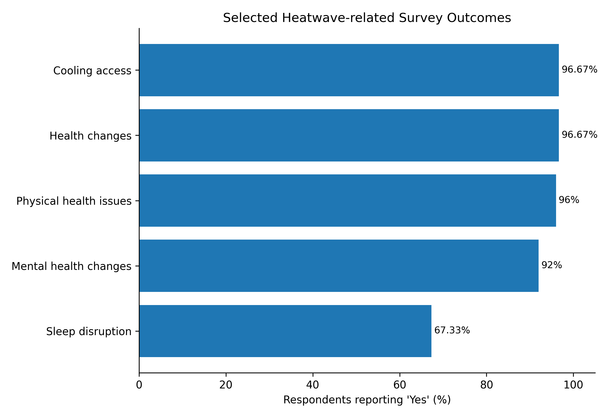
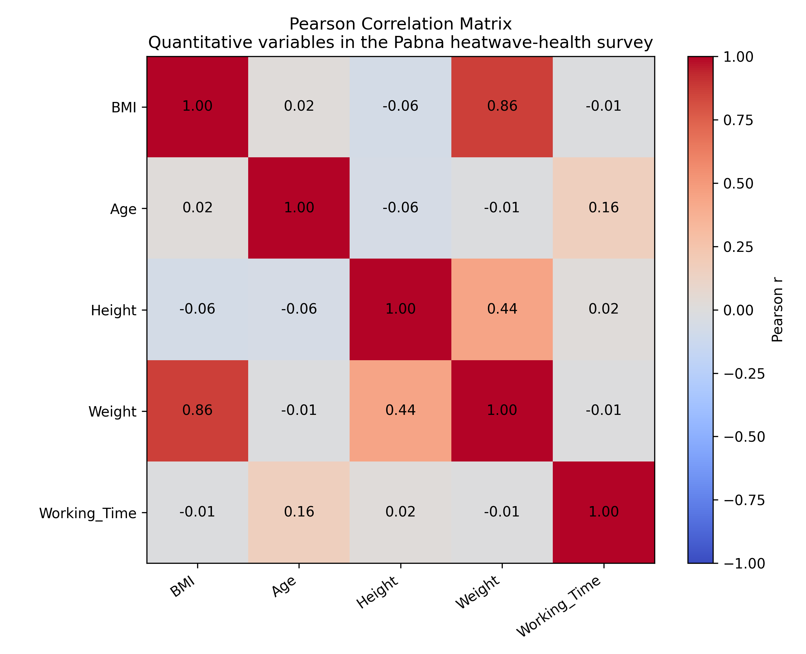
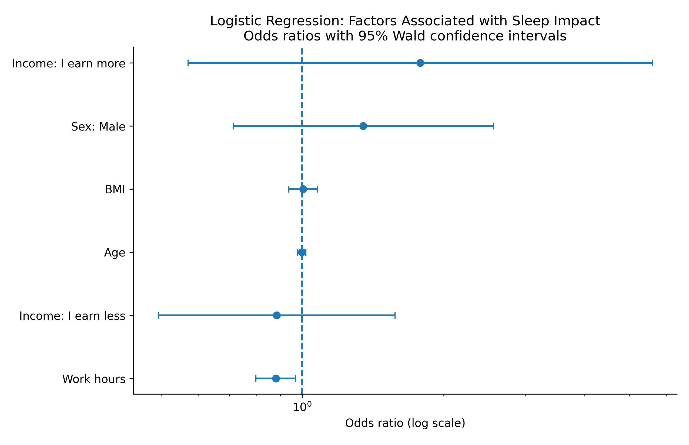

# Impact of Heatwaves on Human Health: A Case Study in Pabna

A reproducible statistical analysis project based on a **300-respondent primary-data field survey** conducted in **Pabna City, Bangladesh**. The study examines self-reported physical health, mental health, lifestyle, work, and socioeconomic experiences during heatwaves.

This project was originally completed as part of the **Statistical Field Survey (STAT-4110)** course in the **Department of Statistics, Pabna University of Science and Technology (PUST)**. The original analysis used SPSS and Excel; this repository adds a reproducible **R-based analysis workflow** and organized public project files.

## Study Overview

- **Location:** Pabna City, Bangladesh
- **Sample size:** 300 respondents
- **Data collection:** 27 September 2023 – 27 October 2023
- **Sampling approach reported in the original study:** Simple random sampling
- **Study population:** Individuals from different socioeconomic and occupational backgrounds, including outdoor workers, businesspeople, construction workers, rickshaw pullers, and others
- **Original software:** SPSS and Microsoft Excel
- **Reproducible portfolio analysis:** R

The questionnaire covered demographics, physical and mental health, sleeping and eating patterns, water consumption, work performance, financial challenges, monthly income, and access to cooling facilities.

## Objectives

The original field survey aimed to:

1. Examine reported physical- and mental-health impacts during heatwaves.
2. Assess changes in eating habits during heatwaves.
3. Examine changes in work performance and productivity.
4. Assess the financial stability of outdoor workers during heatwaves.

## Selected Descriptive Findings

According to the original field-survey report:

- **96.67%** reported health changes during heatwaves.
- **96%** reported physical-health issues during heatwaves.
- **92%** reported mental-health issues during heatwaves.
- **67.34%** reported changes in sleeping patterns.
- **50%** reported eating less during heatwaves.
- **38%** reported a decrease in monthly income.
- **87.67%** reported increased utility bills.
- The sample was **75.34% male** and **24.67% female**.

These values describe respondents' self-reported experiences and should not be interpreted as causal effects.

## Statistical Analysis

The reproducible R workflow includes:

- Data cleaning, standardization, and validation
- Descriptive statistics
- Frequency and percentage distributions
- Data-quality checks
- BMI calculation and categorization
- Pearson correlation analysis
- Pearson chi-square tests
- Likelihood-ratio chi-square tests
- Cramer's V effect-size estimates
- Binary logistic regression
- Odds ratios with confidence intervals
- Omnibus likelihood-ratio model testing
- Hosmer-Lemeshow goodness-of-fit assessment
- Reproducible tables and figures

### Important Reproducibility Note

The original report's logistic-regression section contains inconsistent labels for the dependent and independent variables. Therefore, `05_logistic_regression.R` does **not** claim to reproduce that exact SPSS model. It instead provides a clearly defined extension using:

- **Outcome:** reported impact on sleeping pattern
- **Predictors:** age, sex, working hours, BMI, and monthly-income effect

The R workflow also applies transparent cleaning and grouping rules. As a result, some reproduced statistics may differ from values in the original SPSS report.

## Repository Structure

```text
pabna-heatwave-health-survey/
├── analysis/
│   ├── 00_run_all.R
│   ├── 01_data_cleaning_and_preparation.R
│   ├── 02_descriptive_analysis.R
│   ├── 03_correlation_analysis.R
│   ├── 04_chi_square_analysis.R
│   ├── 05_logistic_regression.R
│   └── ANALYSIS_README.md
│
├── data/
│   ├── data_dictionary.csv
│   ├── heatwave_health_survey_anonymized.csv
│   └── heatwave_health_survey_anonymized.xlsx
│
├── questionnaire/
│   └── field_survey_questionnaire.pdf
│
├── report/
│   └── field_survey_report.pdf
│
├── presentation/
│   └── field_survey_presentation.pdf
│
├── results/
│   ├── figures/
│   └── tables/
│
└── README.md
```

## Key Visualizations

### Heatwave Outcomes



### Pearson Correlation Heatmap



### Logistic Regression Odds Ratios



## How to Reproduce the Analysis

Clone the repository and run the analysis from the repository root.

```bash
git clone https://github.com/Nazmulhossen7/pabna-heatwave-health-survey.git
cd pabna-heatwave-health-survey
Rscript analysis/00_run_all.R
```

The scripts automatically install missing R packages when required.

Main packages used:

```text
readr
dplyr
tidyr
stringr
ggplot2
scales
broom
```

Running the full workflow creates/updates:

```text
data/heatwave_health_survey_cleaned.csv
results/tables/
results/figures/
```

## Data Privacy

The original response file contained direct identifiers. The public dataset in this repository was prepared by removing **respondent names and submission timestamps** and adding a sequential `respondent_id`.

The repository is intended for statistical-analysis demonstration, reproducibility, and academic portfolio use. Users should continue to treat survey data responsibly and avoid attempts to re-identify participants.

## Limitations

- The data are based largely on self-reported experiences and may be affected by recall or response bias.
- The survey is geographically limited to Pabna City, so results should not automatically be generalized to all of Bangladesh.
- The sample was predominantly male.
- The observational survey design supports description and association analysis, not causal conclusions.
- Some R-based results differ from the original report because the reproducible workflow applies explicit data-cleaning and variable-grouping rules.

## Original Academic Materials

- [Full Field Survey Report](report/field_survey_report.pdf)
- [Survey Questionnaire](questionnaire/field_survey_questionnaire.pdf)
- [Field Survey Presentation](presentation/field_survey_presentation.pdf)
- [Analysis Documentation](analysis/ANALYSIS_README.md)

## Project Skills Demonstrated

**Statistical Analysis · R · Data Cleaning · Exploratory Data Analysis · Survey Data · Data Visualization · Pearson Correlation · Chi-Square Testing · Logistic Regression · Reproducible Research**

## Author

**Nazmul Hossen**  
B.Sc. in Statistics  
Pabna University of Science and Technology (PUST)

---

*This repository presents an academic field-survey project together with a reproducible portfolio-oriented re-analysis in R.*
